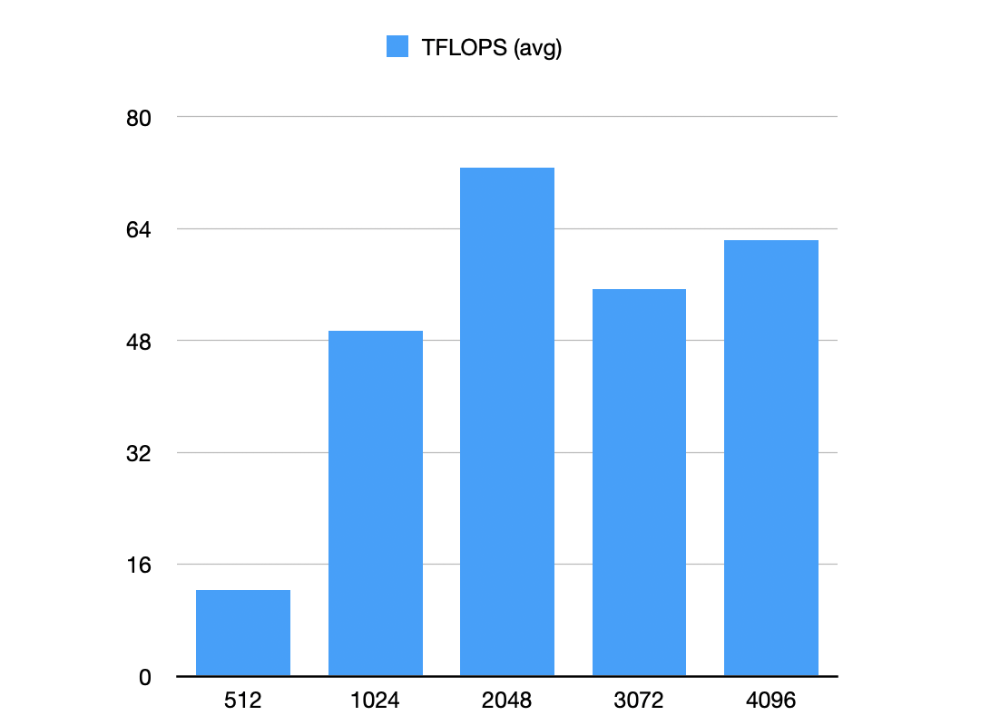
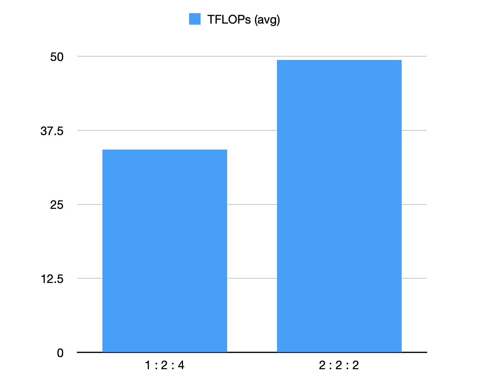

# Matrix Multiply FLOPS

## Introduction

Across many families of neural networks and applications, the common denominator is the use of the generalized matrix multiply operation. Depending on the size and the precision of the input and output matrices, different underlying effects, and more importantly performance metrics, can be observed. Classically, this comes down to the hardware's ability to execute an operation, and its ability to fetch the data for that operation intercept. 

If the data is small and already in registers, the cost to operate on that data is negligible. If the data is in cache, performance is dictated by how quickly the data can be funnelled thought caches to the compute units. In there worst case scenarios, the data needed is in device memory, host memory, or stored on a disk.

Thankfully, matrix multiplication requires more compute operations (2N^3) than memory operations (3n^2). As such, for a given device, there will always be points at which a device is limited by the underlying compute units, not the underlying memory system. We call this point the roofline. 
However, said inversion point depends on the size and crossover point of each cache level/memory technology and the datatype in use. The amount of 8 bit elements that can be moved per unit time is nearly an order of magnitude more than 64 bit elements. 

Therefore, the peak achieved flops changes based on the datatype, the size of the data, and the layout of the data. 

## Operations

### Matrix Multiplication

The WH matrix engine performs 8x16 x 16x16 = 8x16 in a single cycle. \
This is 2*8\*16\*16 = 4096 muladds in a single cycle. At 1GHz, this is 4 TFLOPs per matrix engine. \
The 8x16 is the smallest matrix that can be fed into in0, and 16x16 is the 
smallest matrix that can be fed into in1.

If the input matrices fed into the engine are "shorter" than 8x16, for example 1x16, the engine will still perform 8x16 x 16x16 = 8x16, but the effective throughput will be 1/8. 
Thus, for 1x16 x 16x16 matrices, the effective throughput is 0.5 TFLOP per matrix engine.

MATH_FIDELITY is used for higher precision, and TFLOPs are calculated by dividing by the MATH_FIDELITY value.

LoFi ->  ~4 TFLOPs \
HiFi2 -> ~2 TFLOPs \
HiFi3 -> ~1.33 TFLOPs \
HiFi4 -> ~1 TFLOPs

### Peak Machine FLOPS

Each N300s card is made up of 2 Wormhole ASICs. Each ASIC provides a usable grid of 8 * 8 tensix Cores. 

Depending on the fidelity, datatype, and matrix shape chosen, different peak teraflop values can be achieved. 


For example, running 100 tests cases out of SRAM, where the shape of the input matrices are m,n,k, the inputs are in BF16, and the resolution is of Hifi2, the below results can be achieved: 

```
m	k	n	inference_time_avg (ns)	TFLOPs (avg)

512	512	512	2.180337905883789e-05	12.311644689367128
512	1024	1024	3.8516521453857425e-05	27.877435019315975
512	1024	2048	6.270408630371094e-05	34.247905911562704
1024	1024	1024	4.348278045654297e-05	49.386990101661326
1024	1024	2048	7.58218765258789e-05	56.64548930721963
1024	2048	2048	0.0001335597038269043	64.31531626584545
2048	2048	2048	0.00023612260818481445	72.75825604362807
3072	3072	3072	0.0010478639602661134	55.33357448544656
4096	4096	4096	0.002201988697052002	62.41583058805059
```


#### Square matrices

For most hardware, peak performance is achieved with square matrices that best align with the underlying hardware, for example WH performs best when using Square input matrices, but also when those matrices are of size n=m=k=2048 for data types of BF16 at Hifi2



#### Rectangular matrices 

When deviating from Square matrices, the total balance of compute can be thrown off, lowering peak performance. For example, processing matrices with equal amounts of elements, but different shapes can reduce peak TFLOPS. 

Given input matrix A of 512x1024 and B of 1024x2048 to produce output matrix 512x2048 requires the same amount of computation as if the input matrices were of dimensions 1024^2. However, the performance results are measurably different: 

```
m	k	n	inference_time_avg (ns)	TFLOPs (avg)

512	1024	2048	6.270408630371094e-05	34.247905911562704
1024	1024	1024	4.348278045654297e-05	49.386990101661326
```




## Test it yourself

Assuming you have access to a device (if not, they're available for purchase at Tenstorrent.com), you can test all of the above for yourself by running: `pytest tests/ttnn/unit_tests/benchmarks/test_benchmark.py::test_matmul_2d_host_perf`, available in the ttMetalium repository. 

The parameters of interest are 3 fold:
1. Dimensions: the sizes of the matrix on each edge, denoted as m, n and k 
2. The fidelity of the computation, referred to as lofi, hifi2, hifi3, and hifi4. This effects how many bits of each input datatype is actually ingested during the computation.  
3. Datatype of input/output space. It has been shown that a network layer need not always use all of the bits of a given datatype. But some layers do need the full resolution provided by a given data type, and its higher memory footprint. 


### Understanding device scaling: SRAM vs DRAM

When a tensix core executes an operation, it does so by reading in data from SRAM, forwarding that to a register, executing the operation, and then writing the result back to SRAM. 

Each Tensix core on a WH ASIC has ~1.5MB of SRAM. When feeding data from SRAM, each tensix can operate unencumbered. However some problems require more working memory than is available via SRAM. When this happens, Tensix will instead map data to device memory or DRAM. Accessing data from DRAM is slower both in terms of bandwidth and latency than SRAM. Simultaneously, because of the interconnected nature of the WH ASIC, a clever programmer may often find that the result of one tensix unit is what is needed for the input of another tensix core. Instead of writing that data back to device memory, the data can instead be forwarded directly over the NOC. 